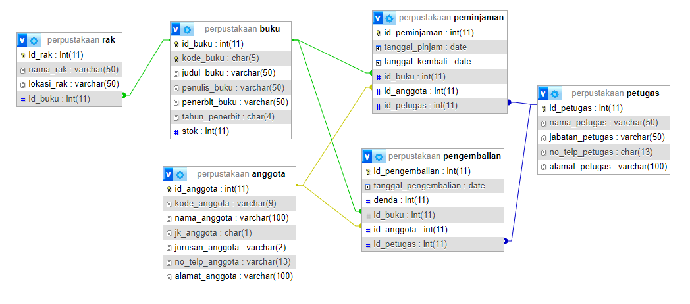

<p align="center"></p>
<h1 align="center">Bookverse<h1>

# Perpustakaan

Selamat datang di Bookverse, sebuah perpustakaan digital yang dibangun menggunakan Yii Framework. Proyek ini dikembangkan sebagai bagian dari Ulangan Tengah Semester untuk mata kuliah Pemrograman Aplikasi Bisnis.

## Daftar Isi
- [Perpustakaan](#perpustakaan)
  - [Daftar Isi](#daftar-isi)
  - [Tentang Proyek](#tentang-proyek)
  - [Schema Database MySql](#schema-database-mysql)
  - [Fitur](#fitur)
    - [Manajemen Buku](#manajemen-buku)
    - [Manajemen Anggota](#manajemen-anggota)
    - [Peminjaman dan Pengembalian](#peminjaman-dan-pengembalian)
    - [Manajemen Rak](#manajemen-rak)
    - [Manajemen Petugas](#manajemen-petugas)
    - [Laporan](#laporan)
  - [Instalasi](#instalasi)
  - [Lisensi](#lisensi)

## Tentang Proyek

Bookverse adalah aplikasi perpustakaan digital yang memungkinkan pengguna untuk mencari, meminjam, dan mengelola buku secara online. Aplikasi ini dibangun menggunakan Yii Framework dan mengikuti pola desain MVC (Model-View-Controller).

## Schema Database MySql

<p align="center"></p>

## Fitur

Berdasarkan struktur database, berikut adalah fitur-fitur yang ada pada aplikasi Bookverse:

### Manajemen Buku
- **Tambah Buku**: Menambah buku baru ke dalam perpustakaan.
- **Edit Buku**: Mengedit informasi buku yang ada.
- **Hapus Buku**: Menghapus buku dari perpustakaan.
- **Cari Buku**: Mencari buku berdasarkan judul, penulis, atau kode buku.

### Manajemen Anggota
- **Tambah Anggota**: Menambah anggota baru ke dalam perpustakaan.
- **Edit Anggota**: Mengedit informasi anggota yang ada.
- **Hapus Anggota**: Menghapus anggota dari perpustakaan.
- **Cari Anggota**: Mencari anggota berdasarkan nama atau kode anggota.

### Peminjaman dan Pengembalian
- **Peminjaman Buku**: Mencatat peminjaman buku oleh anggota.
- **Pengembalian Buku**: Mencatat pengembalian buku yang dipinjam dan menghitung denda jika ada keterlambatan.

### Manajemen Rak
- **Tambah Rak**: Menambah rak baru untuk menempatkan buku.
- **Edit Rak**: Mengedit informasi rak yang ada.
- **Hapus Rak**: Menghapus rak dari perpustakaan.

### Manajemen Petugas
- **Tambah Petugas**: Menambah petugas baru yang mengelola perpustakaan.
- **Edit Petugas**: Mengedit informasi petugas yang ada.
- **Hapus Petugas**: Menghapus petugas dari perpustakaan.

### Laporan
- **Laporan Peminjaman**: Laporan peminjaman buku berdasarkan periode waktu tertentu.
- **Laporan Pengembalian**: Laporan pengembalian buku berdasarkan periode waktu tertentu.

## Instalasi

Ikuti langkah-langkah berikut untuk menginstal dan menjalankan proyek ini secara lokal menggunakan XAMPP:

1. **Unduh dan Instal XAMPP**
    Unduh XAMPP dari [https://www.apachefriends.org/index.html](https://www.apachefriends.org/index.html) dan instal di komputer Anda.

2. **Clone Repository**
    ```bash
    git clone https://github.com/irwanx/BookVerse.git
    ```

3. **Pindahkan Folder ke Direktori XAMPP**
    Pindahkan folder `bookverse` yang telah di-clone ke direktori `htdocs` di dalam folder instalasi XAMPP (misalnya, `C:\xampp\htdocs\bookverse`).

4. **Jalankan XAMPP**
    Buka XAMPP Control Panel dan jalankan `Apache` dan `MySQL`.

5. **Buat Database**
    Buka `phpMyAdmin` melalui `http://localhost/phpmyadmin/` dan buat database baru dengan nama `perpustakaan`.

6. **Import Struktur dan Data Database**
    Import file SQL yang berisi struktur dan data database ke dalam database `perpustakaan` yang baru dibuat melalui `phpMyAdmin`.

7. **Konfigurasi Database**
    Update file `config/db.php` dengan informasi database Anda:
    ```php
    return [
        'class' => 'yii\db\Connection',
        'dsn' => 'mysql:host=localhost;dbname=perpustakaan',
        'username' => 'root',
        'password' => '',
        'charset' => 'utf8',
    ];
    ````

8.  **Akses Aplikasi**
    Buka browser dan akses aplikasi melalui `http://localhost/bookverse/web`.

## Lisensi

Proyek ini dilisensikan di bawah [MIT License](LICENSE).